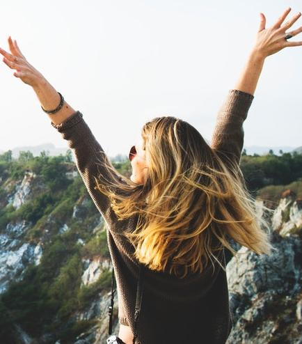

# object-detection-keras-yolo3

[](LICENSE)

**This repository is no longer update.**


This script uses [qqwweee/keras-yolo3](https://github.com/qqwweee/keras-yolo3) to detect 
the top left coordinates, width and height of the objects in the image and 
return them as the list of dictionaries.

## Install

1. Download YOLOv3 weights from [YOLO website](http://pjreddie.com/darknet/yolo/).
2. Convert the Darknet YOLO model to a Keras model.
```
python keras_yolo3/convert.py keras_yolo3/yolov3.cfg yolov3.weights model_data/yolo.h5
```

## Usage
1. Import YOLO class from keras.yolo3.
2. Import get_objects_information function from objects.
3. Create YOLO instance.
4. Call get_objects_information with the YOLO instance and the image path as arguments.
5. The function returns the list of object information dictionaries.  
If there is no object in the image, it returns an empty list.


Each dictionary has the following keys.
* `predicted_name`  Predicted name of the object.
* `x`  x-coordinate at the top left coordinate of the object.
* `y`  y-coordinate at the top left coordinate of the object.
* `width`  width of the object.
* `height`  height of the object.

## Code Example
```python
from PIL import Image
from keras_yolo3.yolo import YOLO
from objects import get_objects_information

if __name__ == '__main__':
    yolo = YOLO()
    image_path = "./picture/sample_picture.jpg"
    objects_info_list = get_objects_information(yolo, image_path)
    yolo.close_session()

    img = Image.open(image_path)
    count = 0
    for object_info in objects_info_list:
        class_name = object_info['predicted_name']
        x = object_info['x']
        y = object_info['y']
        width = object_info['width']
        height = object_info['height']
        cropped_img = img.crop((x, y, x + width, y + height))
        cropped_img.save("./picture/{}{}.jpg".format(class_name, count))
        count = count + 1

```

## Input
Photo by [rawpixel.com](https://www.pexels.com/@rawpixel?utm_content=attributionCopyText&utm_medium=referral&utm_source=pexels) from [Pexels](https://www.pexels.com/photo/casual-cheerful-daylight-friends-541518/?utm_content=attributionCopyText&utm_medium=referral&utm_source=pexels)


## output
person0.jpg  


person1.jpg  

